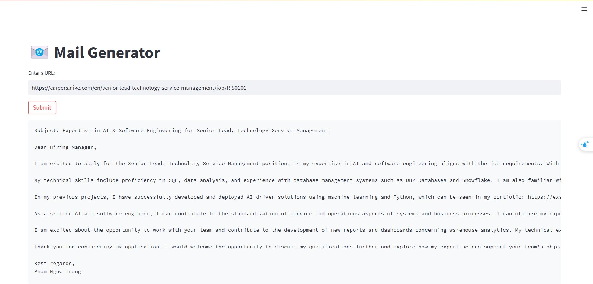

# Cold Email Generator

Đây là một ứng dụng dựa trên Streamlit kết hợp với LangChain nhằm tự động tạo nội dung cold email ứng tuyển. Ứng dụng có thể trích xuất thông tin từ các trang web tuyển dụng và sử dụng mô hình ngôn ngữ để tạo nội dung email phù hợp với các vị trí tuyển dụng.

## Tính năng chính

- **Scraping & Xử lý dữ liệu:**  
  - Sử dụng `WebBaseLoader` để tải nội dung trang web tuyển dụng.
  - Hàm `clean_text` (trong `utils.py`) được sử dụng để làm sạch nội dung HTML, loại bỏ các URL, ký tự đặc biệt và khoảng trắng thừa.

- **Trích xuất thông tin việc làm:**  
  - Lớp `Chain` (trong `chain.py`) gửi prompt đến mô hình ChatGroq (model `llama-3.3-70b-versatile`) để trích xuất các thông tin việc làm từ văn bản đã làm sạch.
  - Các trường thông tin được trích xuất bao gồm: `role`, `experience`, `skills` và `description`.

- **Tích hợp Portfolio:**  
  - Lớp `Portfolio` (trong `portfolio.py`) quản lý danh mục portfolio từ file CSV (ví dụ: `app/resource/my_portfolio.csv`).
  - Dữ liệu portfolio được lưu trữ vào vectorstore sử dụng ChromaDB, giúp truy vấn các liên kết liên quan dựa trên kỹ năng của việc làm.

- **Sinh nội dung email:**  
  - Dựa trên thông tin việc làm và kết quả truy vấn từ portfolio, hệ thống tạo ra nội dung cold email theo định dạng Markdown.
  - Nội dung email được sinh ra thông qua việc kết hợp prompt và mô hình ngôn ngữ.

- **Giao diện Web:**  
  - Ứng dụng sử dụng Streamlit (file `main.py`) để xây dựng giao diện người dùng.
  - Người dùng chỉ cần nhập URL của trang tuyển dụng và nhấn "Submit" để nhận về nội dung email cold email được tạo tự động.
  - Kết quả hiển thị kèm hình ảnh minh họa (`assets/image.jpg`).
  

## Cấu trúc dự án

```
app_1/
├── chain.py         # Định nghĩa lớp Chain để tương tác với LLM, trích xuất thông tin và tạo email.
├── main.py          # Ứng dụng Streamlit chính, xử lý input từ người dùng và hiển thị kết quả.
├── portfolio.py     # Quản lý portfolio, tải dữ liệu từ CSV và thực hiện truy vấn với ChromaDB.
├── utils.py         # Chứa hàm xử lý văn bản, ví dụ: làm sạch HTML.
├── resource/
│   └── my_portfolio.csv   # Dữ liệu danh mục portfolio (mẫu) cho hệ thống.
└── assets/
    └── image.jpg    # Ảnh minh họa kết quả hiển thị.
```

## Yêu cầu
- Python 3.7 trở lên
- Streamlit
- LangChain
- dotenv
- ChromaDB

